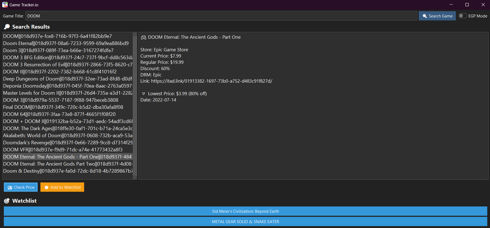

# 🎮 Game Tracker.io

**Game Tracker.io** is a desktop application built with Python and `ttkbootstrap` that lets you search for games, check current and historical prices from multiple stores via the [IsThereAnyDeal](https://isthereanydeal.com) API, and keep a personal watchlist. You can also toggle between USD and EGP currencies.

 <!-- Optional: Add a screenshot of your app -->

---

## ✨ Features

- 🔍 **Search** for any PC game title.
- 💵 **Check current and historical prices** from major online stores.
- 🌍 **Currency toggle** between USD and EGP (via ExchangeRate API).
- ⭐ **Watchlist** support so you can keep track of your favorite games.
- 🧊 Dark UI built with `ttkbootstrap` for a modern look.

---

## 🛠 Requirements

- Python 3.8+
- `requests`
- `ttkbootstrap`
- `python-dotenv`
